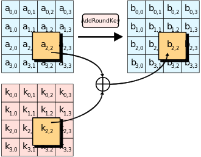
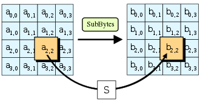
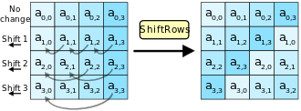

### 部分加密算法
#### AES
目前最为常见的对称加密算法, 为分组加密, 每个分组长度为128bit. 秘钥长度分为128, 192, 256bit三种, 对应的加密轮数为10, 12, 14.
AES加密每一轮的加密过程在一个4*4的矩阵上进行, 初始值也就是明文内容. 每一轮分为四个步骤:
* AddRoundKey: 将矩阵中的每一个字节和回合秘钥进行异或运算, 该轮的子密钥由密钥生成方案产生
    

* SubBytes: 使用s-box对矩阵中所有元素进行替换, 
    

* ShiftRows: 对矩阵中每一行进行左循环位移, 偏移量分别为0, 1, 2, 3
    

* MixColumns: 这里使用$GF(2^8)$上的有限域运算, 将一列的四个元素看做$1,x,x^2,x^3$的系数, 然后将此多项式和固定的多项式$c(x)=3x^3+x^2+x+2$在模$x^4+1$下相乘. 得到的结果按照系数排序写回矩阵中.
    