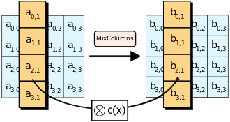

### 部分加密算法
### AES
#### 简介
目前最为常见的对称加密算法, 为分组加密, 每个分组长度为128bit. 秘钥长度分为128, 192, 256bit三种, 对应的加密轮数为10, 12, 14.
AES加密每一轮的加密过程在一个4*4的矩阵上进行, 初始值也就是明文内容. 每一轮分为四个步骤:
* AddRoundKey: 将矩阵中的每一个字节和回合秘钥进行异或运算, 该轮的子密钥由密钥生成方案产生
  
  

* SubBytes: 使用s-box对矩阵中所有元素进行替换, 如其名字, 是对其中每一个元素进行字节上的减少. 这里是使用一个字节的高4位作为行值, 低4位作为列值
  
  

* ShiftRows: 对矩阵中每一行进行左循环位移, 偏移量分别为0, 1, 2, 3
  
  

* MixColumns: 这里使用$GF(2^8)$上的有限域运算, 将一列的四个元素看做$1,x,x^2,x^3$的系数, 然后将此多项式和固定的多项式$c(x)=3x^3+x^2+x+2$在模$x^4+1$下相乘. 得到的结果按照系数排序写回矩阵中.
  
  

#### 安全性与攻击
目前从理论上讲, AES是安全的. 成功的攻击手段都与AES本身无关, 如测信道攻击, 社会工程学等.

### DES
#### 简介
因为其使用56位密钥, 目前已经被认为是不安全的加密算法, 其使用基本被AES替代. 其同样是一种块加密算法, 块长度为64bit. 其密钥为64位, 但是其中8位用于奇偶校验, 在算法中被丢弃, 所以实际作用的密钥只有56位.
总体加密流程如下:

在最开始, 对输入的64位明文进行对半分组, 每组32位, 然后进行IP置换. 置换之后, 对一半使用F函数处理, 而后与另一半异或, 交换左右输入下一轮. 循环执行16轮, 最后进行FP(逆IP)置换, 得到最终输出的密文.

* IP置换: 将64bit按照固定的位置放入一个矩阵中, 每一位有固定的位置. (在DES中这步和FP置换几乎没有密码学上的重要性--Wikipedia)
* 加密轮次: 循环加密16次, 每一次的具体过程如下图. 其中对与右半部分, 需要进行F函数的处理, 并且每一轮加密结束之后需要交换左右.
  
  

* F轮函数: 如上图中展示, 这里是使用每一轮密钥的位置. 每一轮的子密钥由密钥生成规则产生, 在和密钥进行异或操作前后需要对这个块的位数进行修改, 即从32bit通过s-box扩展为48位, 异或之后再反变换为32bit. 最后再经过一个P盒替换.
* 逆IP置换: 上面IP置换的逆过程, 根据固定的替换矩阵置换.
#### 安全性与攻击
由于其本身密钥长度较短, 以现在计算机可以进行暴力破解. 另外还存在快于暴力破解的攻击方法. 这些方法都进行过理论上的证明, 但是在实践中可能存在问题.

**TODO**
* 差分密码分析
* 线性密码分析
* 改进的戴维斯攻击
### 3DES
#### 简介
和DES类似, 是一种对称秘钥块加密算法, 对每个块使用3次DES加密实现, 进而来增长秘钥长度抵抗攻击. 其密钥中包含三个密钥K1, K2, K3, $密文=E_{K3}(D_{K2}(E_{K1}(明文)))$, 那么解密则是$明文=D_{K1}(E_{K2}(D_{K1}(密文)))$
#### 安全性与攻击
正常来说, 其安全性相比DES有较大提升, 其密钥扩展为168bit. 但是因为**中途相遇攻击(Meet-in-the-middle attack)**, 其有效位数只有112位. 对于某些选择明文攻击和已知明文攻击强度较低.

**TODO**
* 中途相遇攻击
* 选择明文攻击
* 已知明文攻击
### RC4
#### 简介
对称流加密算法, 密钥长度可变, 其加密过程就是将明文和密钥进行简单的异或, 解密过程同样是异或. 其安全性在于密钥流生成的过程中.

**TODO**
* 密钥流生成过程
#### 安全性与攻击
目前已被证实可被攻击, 存在多种不同的攻击手段

**TODO**
### RSA
#### 简介
非对称加密算法, 其安全性依赖于大数分解问题, 在目前大部分场景下是安全的. 在非对称加密中存在一对公钥和私钥, 在RSA中, 公钥和私钥按照如下规则产生:
* 随机选择两个大素数$p$和$q$, $p$不等于$q$, 计算$N=pq$;
* 根据欧拉函数求得$r=\phi(N)=\phi(p) \times \phi(q)=(p-1)(q-1)$
* 选择一个小于$r$的整数$e$, 使得$e$与$r$互质, 并求得$e$关于$r$的模逆元$d$. 即$ed \equiv 1(mod r)$
* 最后得到公钥$(N,e)$, 私钥$(N,d)$, 并销毁$p$和$q$

然后对方就可以使用公钥对自己的消息进行加密, 而收到消息的人可以使用对应的私钥进行解密, 因为只有公钥无法推知私钥, 保证了安全性.
加密: $c=n^e mod N$, 解密: $n=c^d mod N$, 其中$c$为密文,$n$为明文.

同样由于公钥和私钥的对应性, 这一方法也可以用来进行签名操作.
> 由于作者本身非数学研究, 且对数学十分头疼, 这里不展示相关数学证明.
#### 安全性与攻击
目前一般认为, 当$N$足够大时, 该加密可以保证安全. 现在推荐$N$保持在2048位以上. 小于等于256位的可以轻松暴力破解. 并且在生成密钥和公钥时需要保证$p$和$q$的随机性, 并且不要选择$e=2$.
仍然存在与算法本身数学设计不相关的攻击手段如测信道攻击等.
### ECC
#### 简介
椭圆曲线加密算法, 一种基于椭圆曲线数学的非对称加密算法.
其数学原理上涉及群, 域等理论, 依赖于椭圆曲线离散对数问题. 其密钥长度小于RSA, 且计算上比RSA快很多, 但是同样具有安全性.
#### 安全性与攻击
从其算法数学推导上看, 目前该算法仍是安全的.
因为其在计算过程中依赖于至少一个椭圆曲线, 而这些曲线又是选定好的, 特定的椭圆曲线可以嵌入后门, 实现有条件的攻击手段.
在量子计算机的攻击下, ECC会比RSA更先被攻破.
### 哈希
> 严格意义上来说, 哈希并不是一种加密算法.
#### 简介
哈希函数, 又称散列函数, 是一种从任何一种数据中创建小的数字指纹的方法. 散列函数把消息或数据计算成摘要, 使得数据量变小, 将数据的格式固定下来. 该函数将数据打乱混合, 重新创建一个叫做散列值(又叫哈希值)的指纹.

一个好的哈希函数要求对于不同的输入很少出现相同的输出, 即散列碰撞.

哈希算法具有不可逆性, 无法通过输出倒推出输入内容, 于是常被用作passwd的保存.

哈希加盐:在密码学中, 盐是在散列之前将散列内容的任意固定位置, 插入特定的字符串. 其作用是让加盐后的散列结果, 和没有加盐的结果不相同. 把特定字符串加入散列内容的动作被称为加盐. 在不同的应用情景中, 这个处理可以增加额外的安全性. 

在大部分情况, 盐是不需要保密的. 盐可以是随机产生的字符串, 其插入的位置可以也是随意而定. 如果这个散列结果在将来需要进行验证, 则需要将已使用的盐记录下来.

加盐可以很大程度上抵抗彩虹表等的攻击手段, 增大哈希的安全性.

部分哈希函数:
* MD5: 将输入转化为128位的散列值, 目前已被证实存在攻击手段.
* SHA-1: 可以将一个最大2^64bit的消息转化为160bit的摘要, 目前已被证实存在攻击手段.
* SHA-256: SHA-2下的一种细分算法, 将输入转化为256bit的散列值, 目前尚未被破解. 

更多函数可以参考这个来自Wikipedia的表
<table class="wikitable" style="margin-top: 0px; width:100%">
<caption>SHA函数对比
</caption>
<tbody><tr style="vertical-align:bottom;">
<th colspan="2">算法和变体
</th>
<th>输出散列值长度 （bits）
</th>
<th>中继散列值长度 （bits）
</th>
<th>资料区块长度 （bits）
</th>
<th>最大输入消息长度 （bits）
</th>
<th>循环次数
</th>
<th>使用到的运算符
</th>
<th>碰撞攻击 （bits）
</th>
<th>性能示例[3]</a> (<a class="mw-redirect" title="Mebibyte">MiB</a>/s)
</th></tr>
<tr style="text-align:center;vertical-align:top;">
<td colspan="2"><b><a>MD5</a></b>（作为参考）</td>
<td>128</td>
<td>128 (4 × 32)</td>
<td>512</td>
<td>无限</a></td>
<td>64</td>
<td>And, Xor, Rot, Add (mod&nbsp;232), Or</td>
<td class="table-no skin-invert" style="text-align:center; background:#FF9090">≤18 （发现碰撞）</td>
<td>335
</td></tr>
<tr style="text-align:center;vertical-align:top;">
<td colspan="2"><b><a class="mw-redirect" title="SHA-0">SHA-0</a></b></td>
<td>160</td>
<td>160 (5 × 32)</td>
<td>512</td>
<td>264 − 1</td>
<td>80</td>
<td rowspan="2">And, Xor, Rot, Add (mod&nbsp;232), Or</td>
<td class="table-no skin-invert" style="text-align:center; background:#FF9090">&lt;34 （发现碰撞）</td>
<td>-
</td></tr>
<tr style="text-align:center;vertical-align:top;">
<td colspan="2"><b><a title="SHA-1">SHA-1</a></b></td>
<td>160</td>
<td>160 (5 × 32)</td>
<td>512</td>
<td>264 − 1</td>
<td>80</td>
<td class="table-no skin-invert" style="text-align:center; background:#FF9090">&lt;63<a></a> （发现碰撞<a title=""></a>）</td>
<td>192
</td></tr>
<tr style="text-align:center;vertical-align:top;">
<td rowspan="2"><b><a title="SHA-2">SHA-2</a></b></td>
<td><i>SHA-224</i> <i>SHA-256</i></td>
<td>224 256</td>
<td>256 (8 × 32)</td>
<td>512</td>
<td>264 − 1</td>
<td>64</td>
<td>And, Xor, Rot, Add (mod&nbsp;232), Or, Shr</td>
<td style="background: #99FF99; color: black; vertical-align: middle; text-align: center;" class="yes table-yes2 skin-invert">112   128</td>
<td>139
</td></tr>
<tr style="text-align:center;vertical-align:top;">
<td><i>SHA-384</i> <i>SHA-512</i> <i>SHA-512/224</i> <i>SHA-512/256</i></td>
<td>384 512 224  256</td>
<td>512 (8 × 64)</td>
<td>1024</td>
<td>2128 − 1</td>
<td>80</td>
<td>And, Xor, Rot, Add (mod&nbsp;264), Or, Shr</td>
<td style="background: #99FF99; color: black; vertical-align: middle; text-align: center;" class="yes table-yes2 skin-invert">192 256 112 128</td>
<td>154
</td></tr>
<tr style="text-align:center;vertical-align:top;">
<td rowspan="2"><b><a title="SHA-3">SHA-3</a></b></td>
<td><i>SHA3-224</i> <i>SHA3-256</i> <i>SHA3-384</i> <i>SHA3-512</i></td>
<td>224 256 384 512</td>
<td rowspan="2">1600 (5 × 5 × 64)</td>
<td>1152 1088 832 576</td>
<td rowspan="2">无限<a ></a></td>
<td rowspan="2">24<a ></a></td>
<td rowspan="2">And, Xor, Rot, Not</td>
<td style="background: #99FF99; color: black; vertical-align: middle; text-align: center;" class="yes table-yes2 skin-invert">112 128 192 256</td>
<td>-
</td></tr>
<tr style="text-align:center;vertical-align:top;">
<td><i>SHAKE128</i> <i>SHAKE256</i></td>
<td><i>d</i> (arbitrary) <i>d</i> (arbitrary)</td>
<td>1344 1088</td>
<td style="background: #99FF99; color: black; vertical-align: middle; text-align: center;" class="yes table-yes2 skin-invert">min(<i>d</i>/2, 128) min(<i>d</i>/2, 256)</td>
<td>-
</td></tr></tbody></table>

#### 安全性与攻击
哈希函数的安全性质:
* 抗碰撞性: 
  
  哈希碰撞: 根据鸽巢原理, 使用有长度限制的哈希值来表示无长度限制的消息时必然会出现碰撞情况, 这在所有的哈希算法中都是不可避免的.

  抗碰撞性指的是在一定时间内很难找到两个不同的输入使其哈希值相同, 即可控哈希碰撞.
  一般使用生日攻击来确认这种性质.
* 抗第一原象性:
  给定已知的哈希值$h$, 一定时间内找不到原始输入$x$使得$hash(x)=h$. 即给定结果, 不能得知原数据的内容.
* 抗第二原象性:
  给定一个输入$x$, 在一定时间内找不到另一个输入$y$使得$hash(x)=hash(y)$, 即不能使用另一段内容伪造出相同的哈希值.