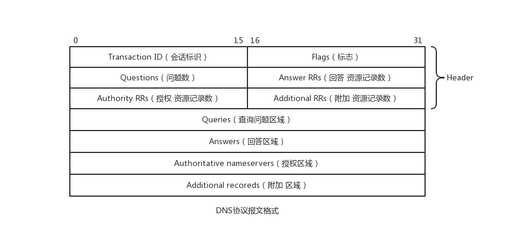

### DNS投毒攻击(DNS posing)

#### 域名分层
域名从右到左分别为顶级域名, 二级域名...等. 如对于`https://www.taobao.com`这个网址, 其域名是`www.taobao.com`, `.com`是顶级域名, `taobao.com`是二级域名, `www.taobao.com`则是三级域名.

#### DNS查询
因为域名是分层的, 所以在进行查询时使用的DNS协议也是分层设计的. 我们可以从DNS服务器中获取部分域名对应的IP地址. DNS服务器具有和域名类似的分层设计, DNS服务器主要分为四层: 根服务器, 顶级域名服务器, 权威域名服务器, 本地域名服务器.

根服务器: 最高层次的域名服务器, 所有的根域名服务器都直到所有顶级域名服务器的域名和IP, 如果本地域名服务器中没有缓存记录, 会首先向根域名服务器发起请求.

顶级域名服务器: 管理在该顶级域名服务器注册的所有二级域名.

权威域名服务器: 负责查询域名的解析设置

本地域名服务器: 每一个ISP都可以拥有一个本地域名服务器, 也被称为默认域名服务器.

**查询过程**:
用户发起请求后, 主机会先查询浏览器缓存和本机操作系统缓存;

本机没有记录, 主机向本地服务器发起查询;

本地服务器没有记录, 会向根服务发起请求;

根据根服务器返回的结果, 本地服务器向对应的顶级服务器发起请求;

根据顶级服务器返回结果, 本地服务器向权威服务器发起请求;

本地服务器将解析记录告知主机, 并保存在本地缓存, 以供下次使用.

#### 攻击

该攻击主要是通过污染DNS缓存, 使用虚假的IP地址信息替换DNS服务器中缓存的真实IP信息, 实现攻击.

DNS系统采用树形结构, 在域名解析的过程中, 会按照域名等级逐级迭代查询, 为了加速查询, 其引入了缓存机制, 即对一段时间内查询过的相关信息进行保存, 在一段时间内再次使用时直接从缓存中获取, 而不是再次查询.

DNS协议本身使用UDP协议进行传输, 这也是其被攻击的位置. 在UDP协议中, 采用相对简单的信任机制, 只对接收到的数据包进行部分内容的查验, 并且一旦受到一个合理的包之后将不再接收其余的数据包. 只要攻击者根据相关内容伪造出合理的数据包, 就可以进行投毒攻击, 攻击效果将持续缓存时间. 攻击的核心在于伪造的数据包应该先于正常的数据包到达.

传统的DNS投毒具有较大局限性, 其攻击时机较为苛刻, 必须在原有缓存失效重新向上请求时进行攻击.

#### Kaminsky攻击
首先介绍DNS协议数据包内部结构:

* Header区域标识会话ID, flag和后面各区域中记录的数目
* Queries区域一般填写需要查询的域名
* 另外三个区域采用相同的格式, 其中存储域名, 查询类型, TTL等数据

### TCP洪水攻击
#### SYN洪水攻击
这种攻击手段利用的是TCP协议在进行三次握手时, 服务器会在接收到请求包之后, 在建立连接之前为该连接预留出资源和空间.

攻击者使用虚假ip向服务器发送大量TCP请求包, 但不完全构建连接, 使得服务器中维护大量处于SYN_RCVD状态的半连接, 将服务器的半连接队列填满, 达到DOS的效果.

* 防御手段: SYN cookie
  