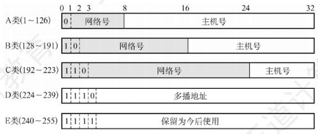
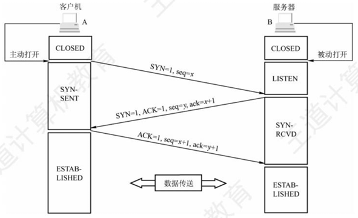
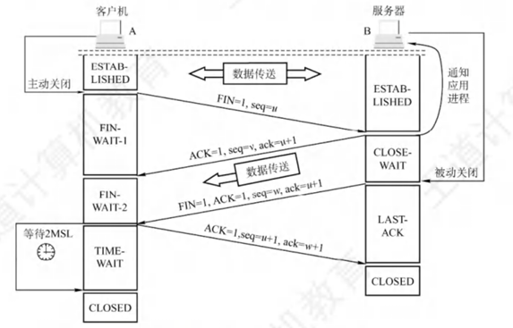
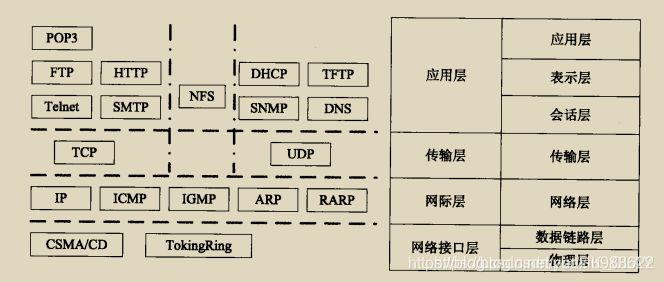

网络安全相关基础内容, 即部分计算机网络的内容
### 网络模型
网络模型分为如下三种

**物理层**: 主要实现相邻节点之间比特流的传递,  在物理媒介(如光纤, 电缆, 无线信号等)上实现原始的数据传输, 尽可能屏蔽传输介质和物理设备的差异.

物理层的设备主要是集线器和中继器, 其主要作用是将信号进行放大和传输, 实现设备之间直接的信号传输. 其没有定向传送能力, 即信号的传递方向是固定的. 对于集线器, 其工作时在某个端口收到信号, 而后经过整形放大, 再将其转发给除输入端口之外的所有端口.

**数据链路层**: 主要实现帧在一段链路上或一个网络中进行传输, 实现封装成帧, 透明传输和差错检测. MAC地址和各种MAC协议如ALOHA协议, CSMA/CD协议, 滑动窗口系列协议等也都存在于数据链路层.

封装成帧指的是在网络层传递下来的数据中前后分别添加首部和尾部, 而后构造数据帧用于传递.

透明传输指的是无论数据在物理层上是什么样的比特组合, 都可以无差错的在这个链路中进行传输. 而透明传输的实现是依赖于封装成帧的, 在封装成帧的过程中, 首部和尾部存在**帧定界**的作用. 而接收方能从接收到的比特流中区分出各个帧的起始和结束, 也就是**帧同步**. 

差错检测中分为位错和帧错, 可以在数据链路层使用某些方法进行检测和纠正.

数据链路层为网络层提供三种服务: 无确认的无连接服务, 有确认的无连接服务, 有确认的面向连接服务. 不存在无确认的面相连接的服务.

以太网交换机工作在数据链路层, 其主要是识别帧头部并按照要求进行转发. 交换机能将网络分成多个冲突域, 按照需求进行转发. 

共享式以太网(集线器组网)和交换式以太网(交换机组网)的区别: 对于共享式以太网, 集线器将消息转发给其余所有端口, 随后收到消息的主机根据自己的MAC地址决定接受还是丢弃; 对于交换式以太网, 交换机收到帧后, 根据其中的目的MAC地址和自己的转发表决定转发给哪个端口(如果是广播帧则转发给除输入外所有端口), 发送给目标主机.

**网络层**: 网络层主要实现的是将一个分组从一台主机跨越多个网络和链路传输到目标主机. 这一过程主要包括分组转发和路由选择. 

在TCP/IP体系结构中, 网络层只向上提供简单灵活, 无连接的, 尽最大努力交付的数据报服务. 

IPv4地址: 共有32位, 分为五类地址. 

其中部分地址存在特殊用处. 主机号全0表示网络本身, 如 202.98.174.0; 主机号全1表示本网络的广播地址; 127.x.x.x表示主机本身, 又称回环地址; 全0表示该网络上本主机; 全1表示整个网络的广播地址, 实际使用时受限于路由器对广播域的隔离等效于本网络的广播地址.

NAT(网络地址转换): 划分部分IP作为私有IP, 只用于LAN中, 不用于WAN连接. 私有IP分为三类: A:10.0.0.0~10.255.255.255; B:172.16.0.0~172.31.255.255; C:192.168.0.0~192.168.255.255. 每个私有网络需要有至少一个合法的外部IP, 用于接受外界信息并转发给网络内部主机.

IPv6是对IPv4的扩展, 其使用将地址长度扩大到128位, 显著缓解了IP地址不够用的问题.

网络层设备--路由器可以分割广播域

**传输层**: 传输层在网络层之上, 主要是为运行在不同主机上的进程之间提供逻辑通信. 在网络层提供了两种不同的传输协议, 即TCP协议和UDP协议.

TCP提供面向连接的可靠服务, UDP提供无连接的不可靠服务.

**TCP三次握手以及四次挥手**:

三次握手图解:

四次挥手图解:

常见协议及其所属的层次:
